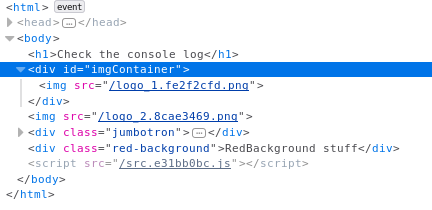

# Handling images

In this demo we are going to include images in our project in two flavours: via JavaScript and via HTML.

We start from sample _04 Bootstrap_.

# Steps to build it

## Prerequisites

Install [Node.js and npm](https://nodejs.org/en/) (min v8.9) if they are not already installed on your computer.

> Verify that you are running at least node v8.x.x and npm 5.x.x by running `node -v` and `npm -v` in a terminal/console window. Older versions may produce errors.

## Steps

- We start from _04 Bootstrap_. Just copy the project and execute _npm install_

```bash
npm install
```

- We continue by creating a folder named **content** inside the **src** folder, and adding two images there: [`logo_1`](./src/content/logo_1.png) and [`logo_2`](./src/content/logo_2.png).

- Let's add a div container to place an image.

_./src/index.html_

```diff
  <h1>Check the console log</h1>
+ <div id="imgContainer"></div>  
  <div class="jumbotron">
```

- Let's jump into _`index.js`_ and import [`logo_1`](./src/content/logo_1.png) using JavaScript. Then, let's place it under a `<div>` with a given `id`:

_./src/index.js_

```diff
import './mystyles.scss';
+ import logoImg from './content/logo_1.png';

const sampleNumber = 1;
console.log(`Hello from sample ${sampleNumber}`);

+ const img = document.createElement('img');
+ img.src = logoImg;

+ document.getElementById('imgContainer').appendChild(img);
```

- Now, what if we had already the image referenced inside a HTML `` tag? Let's add [`logo_2.png`](./src/content/logo_2.png) into the index.html file:

_./src/index.html_

```diff
  <h1>Check the console log</h1>
  <div id="imgContainer"></div>  
+ 
  <div class="jumbotron">
```

- Let's run the sample.

```bash
npm start
```

- We could see that parcel resolve the images `src` to be loaded by server:


